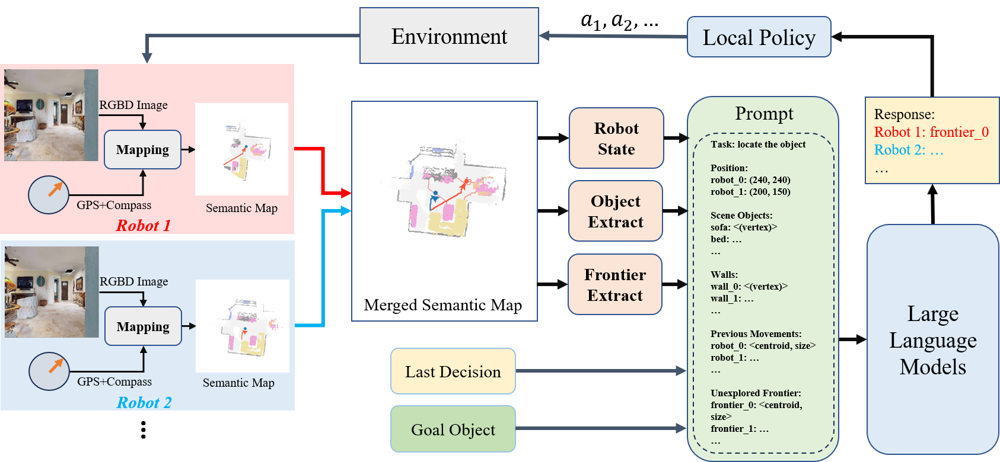

# Co-NavGPT: Multi-Robot Cooperative Visual Semantic Navigation using Large Language Models

This work is based on our paper. We proposed a new framework to explore and search for the target in unknown environment based on Large Language Model. Our work is based on [SemExp](https://github.com/devendrachaplot/Object-Goal-Navigation) and [L3MVN](https://sites.google.com/view/l3mvn), implemented in PyTorch.

**Author:** Bangguo Yu, Hamidreza Kasaei and Ming Cao

**Affiliation:** University of Groningen

## Abstract

In advanced human-robot interaction tasks, visual target navigation is crucial for autonomous robots navigating unknown environments. While numerous approaches have been developed in the past, most are designed for single-robot operations, which often suffer from reduced efficiency and robustness due to environmental complexities. Furthermore, learning policies for multi-robot collaboration is resource-intensive. To address these challenges, we propose Co-NavGPT, an innovative framework that integrates Large Language Models (LLMs) as a global planner for multi-robot cooperative visual target navigation. Co-NavGPT encodes the explored environment data into prompts, enhancing LLMs’ scene comprehension. It then assigns exploration frontiers to
each robot for efficient target search. Experimental results on Habitat-Matterport 3D (HM3D) demonstrate that Co-NavGPT surpasses existing models in success rates and efficiency without any learning process, demonstrating the vast potential of LLMs in multi-robot collaboration domains. The supplementary video, prompts, and code can be accessed via the following link: https://sites.google.com/view/co-navgpt.



## Installation

The code has been tested only with Python 3.10.8, CUDA 11.7.

1. Installing Dependencies
- We use adjusted versions of [habitat-sim](https://github.com/facebookresearch/habitat-sim) and [habitat-lab](https://github.com/facebookresearch/habitat-lab) as specified below:

-Installing habitat-sim:
```
git clone https://github.com/facebookresearch/habitat-sim.git
cd habitat-sim; git checkout tags/challenge-2022; 
pip install -r requirements.txt; 
python setup.py install --headless
python setup.py install # (for Mac OS)
```

-Installing habitat-lab:
```
git clone https://github.com/facebookresearch/habitat-lab.git
cd habitat-lab; git checkout tags/challenge-2022; 
pip install -e .
```

- Install [pytorch](https://pytorch.org/) according to your system configuration. The code is tested on torch v2.0.1, torchvision 0.15.2. 

- Install [detectron2](https://github.com/facebookresearch/detectron2/) according to your system configuration. If you are using conda:
```
python -m pip install detectron2 -f https://dl.fbaipublicfiles.com/detectron2/wheels/cu102/torch1.6/index.html #(Linux with GPU)
CC=clang CXX=clang++ ARCHFLAGS="-arch x86_64" python -m pip install 'git+https://github.com/facebookresearch/detectron2.git' #(Mac OS)
```

2. Download HM3D_v0.2 datasets:

#### Habitat Matterport
Download [HM3D](https://aihabitat.org/datasets/hm3d/) dataset using download utility and [instructions](https://github.com/facebookresearch/habitat-sim/blob/main/DATASETS.md#habitat-matterport-3d-research-dataset-hm3d):
```
python -m habitat_sim.utils.datasets_download --username <api-token-id> --password <api-token-secret> --uids hm3d_minival_v0.2
```

3. Download additional datasets

Download the [segmentation model](https://drive.google.com/file/d/1U0dS44DIPZ22nTjw0RfO431zV-lMPcvv/view?usp=share_link) in RedNet/model path.


## Setup
Clone the repository and install other requirements:
```
git clone https://github.com/ybgdgh/L3MVN
cd L3MVN/
pip install -r requirements.txt
```

### Setting up datasets
The code requires the datasets in a `data` folder in the following format (same as habitat-lab):
```
Object-Goal-Navigation/
  data/
    scene_datasets/
    matterport_category_mappings.tsv
    object_norm_inv_perplexity.npy
    versioned_data
    objectgoal_hm3d/
        train/
        val/
        val_mini/
```


### For evaluation: 
For evaluating the framework:
```
python exp_main_gpt.py
```


## Demo Video

[video](https://sites.google.com/view/co-navgpt)